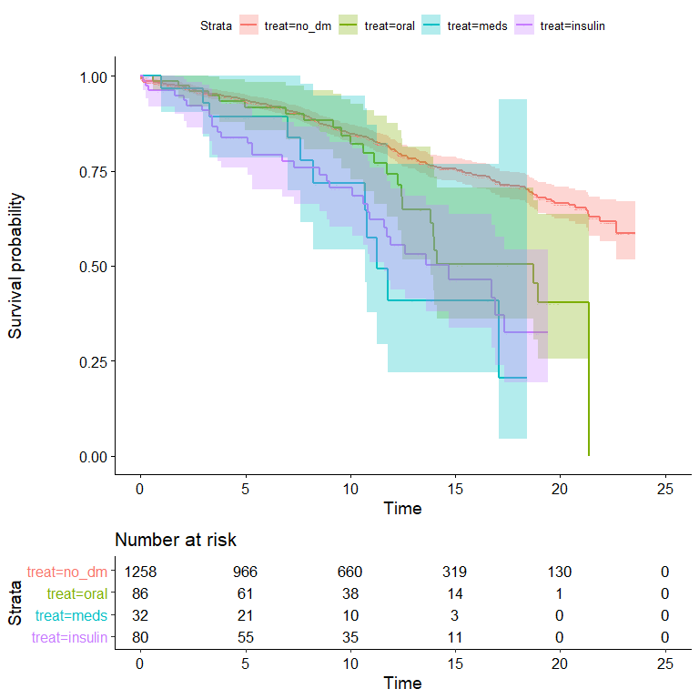
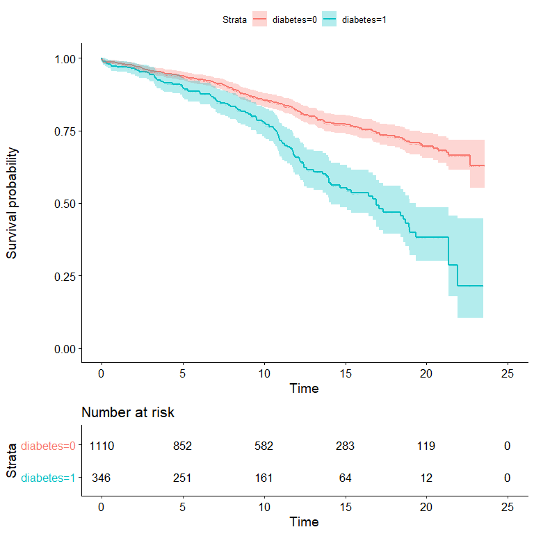
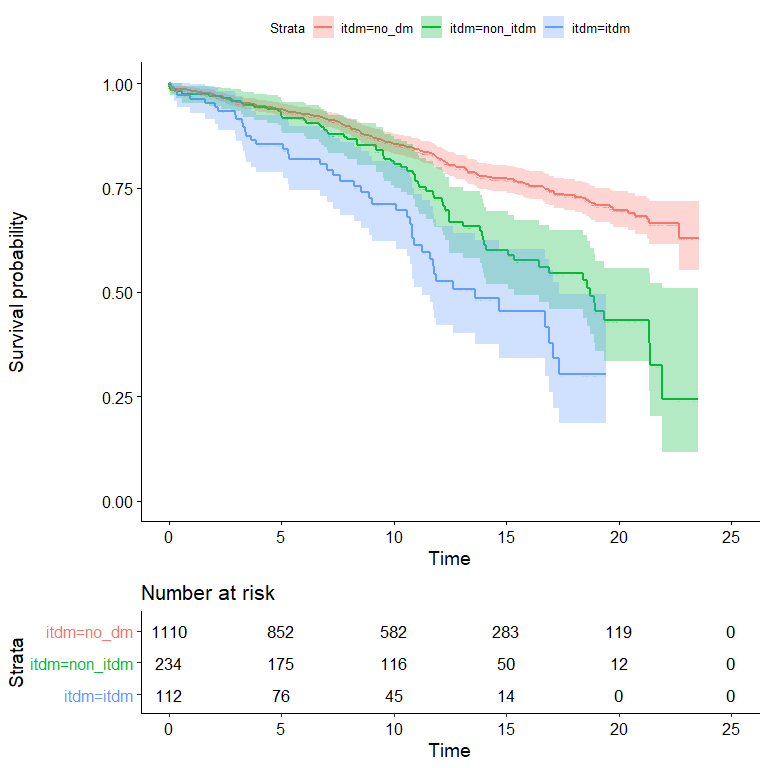

MIDCAB in DM
================

Script to import and clean, reformat the dataset for MICAB outcome
according to preoperative diabetes mellitus.

``` r
library(easypackages)
libraries(c("tidyverse","rms","Hmisc","survival",
            "tableone", "readxl","survminer"))
```

    ## Loading required package: tidyverse

    ## Warning: package 'tidyverse' was built under R version 4.0.3

    ## -- Attaching packages --------------------------------------- tidyverse 1.3.0 --

    ## v ggplot2 3.3.2     v purrr   0.3.4
    ## v tibble  3.0.4     v dplyr   1.0.2
    ## v tidyr   1.1.2     v stringr 1.4.0
    ## v readr   1.4.0     v forcats 0.5.0

    ## Warning: package 'tibble' was built under R version 4.0.3

    ## Warning: package 'tidyr' was built under R version 4.0.3

    ## Warning: package 'readr' was built under R version 4.0.3

    ## -- Conflicts ------------------------------------------ tidyverse_conflicts() --
    ## x dplyr::filter() masks stats::filter()
    ## x dplyr::lag()    masks stats::lag()

    ## Loading required package: rms

    ## Warning: package 'rms' was built under R version 4.0.3

    ## Loading required package: Hmisc

    ## Warning: package 'Hmisc' was built under R version 4.0.3

    ## Loading required package: lattice

    ## Loading required package: survival

    ## Warning: package 'survival' was built under R version 4.0.3

    ## Loading required package: Formula

    ## Warning: package 'Formula' was built under R version 4.0.3

    ## 
    ## Attaching package: 'Hmisc'

    ## The following objects are masked from 'package:dplyr':
    ## 
    ##     src, summarize

    ## The following objects are masked from 'package:base':
    ## 
    ##     format.pval, units

    ## Loading required package: SparseM

    ## 
    ## Attaching package: 'SparseM'

    ## The following object is masked from 'package:base':
    ## 
    ##     backsolve

    ## Loading required package: tableone

    ## Warning: package 'tableone' was built under R version 4.0.3

    ## Loading required package: readxl

    ## Loading required package: survminer

    ## Loading required package: ggpubr

    ## All packages loaded successfully

``` r
# getting the dataset.

df <- read_csv("D:\\MIDCAB_DM\\midcab_dm.csv")
```

    ## 
    ## -- Column specification --------------------------------------------------------
    ## cols(
    ##   .default = col_double(),
    ##   surg_date = col_character(),
    ##   dob = col_character(),
    ##   admit_date = col_character(),
    ##   preop_egfr = col_character(),
    ##   pci_date = col_character(),
    ##   PCI_after_MIDCAB_Date = col_character(),
    ##   Last_cardiac_surgery_date = col_character(),
    ##   discharge_date = col_character(),
    ##   Last_contact_date = col_character(),
    ##   Date_of_death = col_character(),
    ##   ReOP1_Date = col_character()
    ## )
    ## i Use `spec()` for the full column specifications.

    ## Warning: 1 parsing failure.
    ##  row           col expected  actual                           file
    ## 1181 time_from_pci a double #VALUE! 'D:\MIDCAB_DM\midcab_dm.csv'

``` r
# str(df)

df %>% count(cad)
```

    ## # A tibble: 3 x 2
    ##     cad     n
    ##   <dbl> <int>
    ## 1     1  1456
    ## 2     2   737
    ## 3     3   474

-   keep only patients with SVD.

``` r
df1 <- df %>% filter(cad == 1) 

# now df1 contains only LIMA - LAD patients here.

# glimpse(df1)

df1 %>% count(diabetes)
```

    ## # A tibble: 2 x 2
    ##   diabetes     n
    ##      <dbl> <int>
    ## 1        0  1110
    ## 2        1   346

``` r
# here we have 346 patients with DM and 1110 without.

df1 %>% count(ohga)
```

    ## # A tibble: 2 x 2
    ##    ohga     n
    ##   <dbl> <int>
    ## 1     0  1338
    ## 2     1   118

``` r
df1 %>% count(insulin)
```

    ## # A tibble: 2 x 2
    ##   insulin     n
    ##     <dbl> <int>
    ## 1       0  1344
    ## 2       1   112

``` r
# we also have diet treated DM.

df1$diet_rx = with(df1, ifelse(diabetes == 1 & ohga == 1 & insulin == 0 , 1, 0))

df1 %>% count(diet_rx)
```

    ## # A tibble: 2 x 2
    ##   diet_rx     n
    ##     <dbl> <int>
    ## 1       0  1370
    ## 2       1    86

``` r
# so for the dm patients, make a var for treatment. diet = 1, ohga = 2, insulin = 3

df1$treat <- with(df1, ifelse(diabetes == 1 & diet_rx == 1, 1, 
                              ifelse(diabetes == 1 & ohga == 1, 2,
                                     ifelse(diabetes == 1 & insulin == 1, 3, 0))))


df1 %>% count(treat)
```

    ## # A tibble: 4 x 2
    ##   treat     n
    ##   <dbl> <int>
    ## 1     0  1258
    ## 2     1    86
    ## 3     2    32
    ## 4     3    80

``` r
df1$treat = factor(df1$treat, levels = c(0,1,2,3),
                   labels = c("no_dm","oral","meds","insulin"))


df1$itdm <- with(df1, ifelse(diabetes == 1 & insulin == 1, 2,
                             ifelse(diabetes == 1 & insulin == 0, 1, 0)))

df1$itdm = factor(df1$itdm, levels = c(0,1,2),
                  labels = c("no_dm","non_itdm","itdm"))
```

Now to look at the outcome briefly, before cleaning the data.

``` r
df1$survyears = (1 + df1$Survival_days)/365.24

s <- survfit(Surv(survyears, Died_total) ~ treat, data = df1)

s2 <- survfit(Surv(survyears, Died_total) ~ diabetes, data = df1)

s3 <- survfit(Surv(survyears, Died_total) ~ itdm, data = df1)
```

``` r
ggsurvplot(s, conf.int = T,risk.table = T,
           censor.size = 0)
```

    ## Warning: Vectorized input to `element_text()` is not officially supported.
    ## Results may be unexpected or may change in future versions of ggplot2.

<!-- -->

``` r
ggsurvplot(s2, conf.int = T,risk.table = T,
           censor.size = 0)
```

    ## Warning: Vectorized input to `element_text()` is not officially supported.
    ## Results may be unexpected or may change in future versions of ggplot2.

<!-- -->

``` r
ggsurvplot(s3, conf.int = T,risk.table = T,
           censor.size = 0)
```

    ## Warning: Vectorized input to `element_text()` is not officially supported.
    ## Results may be unexpected or may change in future versions of ggplot2.

<!-- -->
